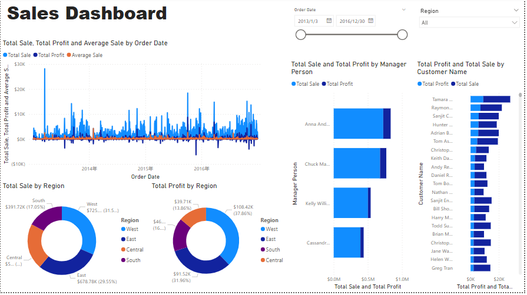
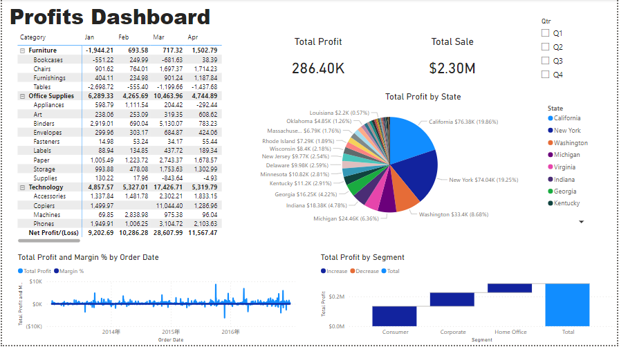

# PowerBI: USA Superstore Project

## Project/Goals
1. Data precessing, and transform using PowerBI
2. Creating impactful dashboards and story to help stakeholder make decisions
3. Communicating insights with the correct visualizations

## Process
### Step 1:
Data Transforming.

### Step 2:

Create visualizations and explore the data.

## Results
Results and insights. 
1. The total sale in 2016 is higher than the other years.

2. The East and West regions have the highest sales.

3. Technology category makes the biggest profit vs table has the highest loss.

4. California and New York have the highest profits among other states.

